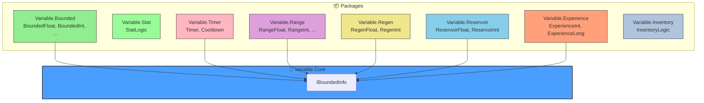

# GameVariable

**GameVariable** is a modular, high-performance C# library designed to handle common game state variables with ease. From health bars and ammo clips to experience curves and cooldowns, GameVariable provides the structs and logic you need to build robust game systems. Unity ECS compatible, and can be used with any game engine or multiplayer framework.


## Packages

| Package | Description |
| :--- | :--- |
| `Variable.Core` | Core interfaces and types. |
| `Variable.Bounded` | `BoundedFloat`, `BoundedInt` for clamped values (HP, MP). |
| `Variable.Stat` | `StatLogic` for RPG stats and modifiers. |
| `Variable.Inventory` | Logic for capacity and transfers. |
| `Variable.Timer` | `Cooldown`, `Timer` for time tracking. |
| `Variable.Experience` | Leveling and XP systems. |
| `Variable.Range` | `RangeFloat`, `RangeInt` for min/max randomization. |
| `Variable.Regen` | `RegenFloat` for auto-regeneration/decay. |
| `Variable.Reservoir` | `ReservoirInt`, `ReservoirFloat` for ammo/batteries. |

---

## Architecture



### Design Philosophy

- **🎯 Pure Data Structs**: All types are unmanaged `structs` — no heap allocations, GC-friendly
- **⚡ Burst Compatible**: All code is fully compatible with Unity's Burst compiler and DOTS/ECS
- **🔄 Zero Dependencies**: Each package is standalone with minimal cross-dependencies
- **📐 Single Responsibility**: Logic is separated from data (use `StatLogic`, not methods on stats)
- **🎮 Game-First API**: Intuitive operators (`hp -= 10`, `timer++`) for natural game code

---

## 100 Game Mechanics Examples

Here is how you can implement 100 common game mechanics using the **GameVariable** ecosystem.

### 1-10: Core Player Stats

**1. Health (HP)**
*The universal survival metric.*
```csharp
using Variable.Bounded;

// Max 100, Current 100
BoundedFloat hp = new BoundedFloat(100f); 
hp -= 10f; // Take damage
if (hp.IsEmpty()) Die();
```

**2. Mana (MP)**
*The resource for special abilities.*
```csharp
using Variable.Regen;

// Max 100, Current 100, Regens 5 per second
RegenFloat mana = new RegenFloat(100f, 100f, 5f); 
mana.Tick(Time.deltaTime); // Auto-regen
```

**3. Stamina**
*Physical exertion limit.*
```csharp
using Variable.Regen;

// Fast regen (20/sec)
RegenFloat stamina = new RegenFloat(100f, 100f, 20f);
if (stamina >= 10f) {
    stamina.Value -= 10f; // Sprint cost
    Sprint();
}
```

**4. Experience (XP)**
*Progress toward the next state.*
```csharp
using Variable.Experience;

// Current Level 1, 0 XP, Target 1000
ExperienceInt xp = new ExperienceInt(1, 0, 1000);
// Add 500 XP, with a formula for next level requirement (e.g., level * 1000)
if (xp.Add(500, level => level * 1000)) LevelUp(); 
```

**5. Time/Timer**
*Countdown or count-up.*
```csharp
using Variable.Timer;

// 60 second countdown
Timer timer = new Timer(60f);
timer.Tick(Time.deltaTime);
if (timer.IsFinished) EndGame();
```

**6. Ammo/Clip**
*Shots available before reload.*
```csharp
using Variable.Reservoir;

// Clip 30, Reserve 120
ReservoirInt ammo = new ReservoirInt(30, 30, 120);
if (ammo > 0) {
    ammo.Volume--; // Shoot
} else {
    ammo.Refill(); // Reload from reserve
}
```

**7. Currency (Soft)**
*Gold, Credits.*
```csharp
using Variable.Bounded;

// Wallet cap 9999
BoundedInt gold = new BoundedInt(9999, 0);
gold += 100; // Loot
```

**8. Cooldown**
*Time until an action is available.*
```csharp
using Variable.Timer;

Cooldown dashCd = new Cooldown(3f); // 3s cooldown
if (dashCd.IsReady) {
    Dash();
    dashCd.Restart();
}
dashCd.Tick(Time.deltaTime);
```

**9. Shield/Barrier**
*Secondary health layer.*
```csharp
using Variable.Regen;

// 50 Shield, regens 10/sec
RegenFloat shield = new RegenFloat(50f, 50f, 10f);
// Custom logic: Stop regen if damaged recently
if (Time.time - lastDamageTime > 3f) shield.Tick(Time.deltaTime);
```

**10. Level**
*The discrete tier of power.*
```csharp
using Variable.Bounded;

// Max level 99
BoundedInt level = new BoundedInt(99, 1);
```

### 11-30: Survival & Simulation Attributes

**11. Hunger/Satiety**
*Decay over time.*
```csharp
using Variable.Regen;

// Decays 1 per second
RegenFloat hunger = new RegenFloat(100f, 100f, -1f);
hunger.Tick(Time.deltaTime);
```

**12. Thirst/Hydration**
*Faster decay than hunger.*
```csharp
using Variable.Regen;

// Decays 2 per second
RegenFloat thirst = new RegenFloat(100f, 100f, -2f);
```

**13. Oxygen/Breath**
*Depletes only in specific states.*
```csharp
using Variable.Bounded;

BoundedFloat oxygen = new BoundedFloat(100f);
if (isUnderwater) oxygen -= 10f * Time.deltaTime;
else oxygen += 20f * Time.deltaTime; // Refill surface
```

**14. Energy/Sleep**
*Long-term stamina.*
```csharp
using Variable.Bounded;

BoundedFloat energy = new BoundedFloat(100f);
// Sleep restores energy
void Sleep() => energy.Current = energy.Max;
```

**15. Temperature**
*Body heat vs. Environment.*
```csharp
using Variable.Range;

RangeFloat bodyTemp = new RangeFloat(35f, 42f, 37f); // Min 35 (hypo), Max 42 (hyper), Current 37
```

**16. Toxicity/Radiation**
*Accumulation of harmful status.*
```csharp
using Variable.Bounded;

BoundedFloat rads = new BoundedFloat(1000f, 0f);
rads += 5f * Time.deltaTime; // Standing in waste
```

**17. Weight/Encumbrance**
*Inventory load.*
```csharp
using Variable.Bounded;

BoundedFloat weight = new BoundedFloat(100f, 0f); // Max 100kg
bool isOverencumbered => weight.IsFull();
```

**18. Durability**
*Item health.*
```csharp
using Variable.Bounded;

BoundedInt durability = new BoundedInt(100, 100);
durability--; // Use item
if (durability.IsEmpty()) BreakItem();
```

**19. Sanity/Stress**
*Mental health metric.*
```csharp
using Variable.Bounded;

BoundedFloat sanity = new BoundedFloat(100f, 100f);
sanity -= horrorAmount;
```

**20. Hygiene**
*Cleanliness level.*
```csharp
using Variable.Regen;

RegenFloat hygiene = new RegenFloat(100f, 100f, -0.5f); // Slow decay
```

**21. Bladder**
*Waste accumulation.*
```csharp
using Variable.Regen;

// Fills up over time (Positive rate)
RegenFloat bladder = new RegenFloat(100f, 0f, 2f);
```

**22. Fuel**
*Vehicle or machine resource.*
```csharp
using Variable.Reservoir;

ReservoirFloat fuel = new ReservoirFloat(50f, 50f, 200f); // Tank 50, Jerry cans 200
```

**23. Battery/Charge**
*Electronic device power.*
```csharp
using Variable.Reservoir;

ReservoirFloat battery = new ReservoirFloat(100f, 100f, 500f); // 100% charge, 5 spares
```

**24. Spoilage**
*Freshness of food items.*
```csharp
using Variable.Timer;

Timer freshness = new Timer(300f); // 5 minutes until rot
```

**25. Age**
*Biological lifespan.*
```csharp
using Variable.Bounded;

BoundedInt age = new BoundedInt(100, 0);
```

**26. Comfort**
*Environmental bonus metric.*
```csharp
using Variable.Bounded;

BoundedFloat comfort = new BoundedFloat(10f, 0f);
```

**27. Environment Moisture**
*Wetness.*
```csharp
using Variable.Bounded;

BoundedFloat wetness = new BoundedFloat(100f, 0f);
if (isRaining) wetness += 10f * Time.deltaTime;
```

**28. Metabolism**
*Rate at which hunger/thirst decays.*
```csharp
float metabolismMult = 1.5f; // Running increases burn
hunger.Rate = -1f * metabolismMult;
```

**29. Immunity**
*Resistance build-up.*
```csharp
using Variable.Bounded;

BoundedFloat immunity = new BoundedFloat(100f, 0f);
```

**30. Blood Pool**
*Vampire logic.*
```csharp
using Variable.Reservoir;

ReservoirFloat blood = new ReservoirFloat(10f, 10f, 0f); // No reserve, must feed
```

### 31-50: Combat Mechanics & Action

**31. Rage/Fury**
*Generates on hit.*
```csharp
using Variable.Bounded;

BoundedFloat rage = new BoundedFloat(100f, 0f);
void OnHit() => rage += 15f;
```

**32. Focus/Concentration**
*Slow-motion resource.*
```csharp
using Variable.Regen;

RegenFloat focus = new RegenFloat(100f, 100f, 5f); // Regens slowly
```

**33. Adrenaline**
*Temporary boost, decays rapidly.*
```csharp
using Variable.Regen;

RegenFloat adrenaline = new RegenFloat(100f, 0f, -10f); // Decays fast
void OnScare() => adrenaline.Value = 100f;
```

**34. Poise/Balance**
*Invisible meter before staggering.*
```csharp
using Variable.Regen;

RegenFloat poise = new RegenFloat(100f, 100f, 20f); // Regens fast
```

**35. Stun Meter**
*Buildup to incapacitation.*
```csharp
using Variable.Regen;

// Decays (recovers) when not hit
RegenFloat stun = new RegenFloat(100f, 0f, -5f); 
```

**36. Combo Meter**
*Count/Time remaining.*
```csharp
using Variable.Timer;

Timer comboTimer = new Timer(2f);
int comboCount = 0;
void Hit() { comboCount++; comboTimer.Restart(); }
```

**37. Ultimate Charge**
*0 to 100% build-up.*
```csharp
using Variable.Bounded;

BoundedFloat ult = new BoundedFloat(100f, 0f);
```

**38. Recoil**
*Stability loss.*
```csharp
using Variable.Regen;

RegenFloat recoil = new RegenFloat(10f, 0f, -5f); // Recovers stability
void Shoot() => recoil.Value += 2f;
```

**39. Heat/Overheat**
*Weapon thermal limit.*
```csharp
using Variable.Regen;

RegenFloat heat = new RegenFloat(100f, 0f, -10f); // Cools down
if (heat.IsFull()) JamWeapon();
```

**40. Armor Integrity**
*Physical armor points.*
```csharp
using Variable.Bounded;

BoundedFloat armor = new BoundedFloat(200f);
```

**41. Posture**
*Guard capability.*
```csharp
using Variable.Regen;

RegenFloat posture = new RegenFloat(100f, 100f, 10f);
```

**42. Breath Hold**
*Sniping stability.*
```csharp
using Variable.Bounded;

BoundedFloat breath = new BoundedFloat(10f, 10f);
```

**43. Stealth/Visibility**
*Eye meter.*
```csharp
using Variable.Bounded;

BoundedFloat visibility = new BoundedFloat(100f, 0f);
```

**44. Noise**
*Sound generated.*
```csharp
using Variable.Bounded;

BoundedFloat noise = new BoundedFloat(100f, 0f);
```

**45. Revive Timer**
*Time to bleed out.*
```csharp
using Variable.Timer;

Timer bleedOut = new Timer(30f);
```

**46. Invulnerability**
*I-Frames.*
```csharp
using Variable.Timer;

Timer iFrames = new Timer(0.5f);
```

**47. Cast Time**
*Channeling duration.*
```csharp
using Variable.Timer;

Timer castTime = new Timer(2.5f);
```

**48. Dodge Charges**
*Discrete movement tokens.*
```csharp
using Variable.Reservoir;

// 3 charges, regens 1 every 2 seconds (custom logic needed for discrete regen)
ReservoirInt dodges = new ReservoirInt(3, 3, 0); 
```

**49. Parry Window**
*Active frames.*
```csharp
using Variable.Timer;

Timer parryWindow = new Timer(0.2f);
```

**50. Threat/Aggro**
*AI attention.*
```csharp
using Variable.Bounded;

BoundedFloat threat = new BoundedFloat(1000f, 0f);
```

### 51-70: Vehicle & Physics

**51. Speed/Velocity**
```csharp
using Variable.Bounded;

BoundedFloat speed = new BoundedFloat(200f, 0f); // Max 200 mph
```

**52. RPM**
```csharp
using Variable.Bounded;

BoundedFloat rpm = new BoundedFloat(8000f, 0f);
```

**53. Boost/Nitro**
```csharp
using Variable.Reservoir;

ReservoirFloat nitro = new ReservoirFloat(100f, 100f, 0f);
```

**54. Tire Grip/Wear**
```csharp
using Variable.Bounded;

BoundedFloat tireWear = new BoundedFloat(100f, 100f); // 100% grip
```

**55. Hull Integrity**
```csharp
using Variable.Bounded;

BoundedFloat hull = new BoundedFloat(1000f);
```

**56. Altitude**
```csharp
using Variable.Bounded;

BoundedFloat altitude = new BoundedFloat(50000f, 0f);
```

**57. Depth**
```csharp
using Variable.Bounded;

BoundedFloat depth = new BoundedFloat(1000f, 0f);
```

**58. G-Force**
```csharp
using Variable.Bounded;

BoundedFloat gForce = new BoundedFloat(9f, 0f); // Blackout at 9G
```

**59. Cargo Space**
```csharp
using Variable.Bounded;

BoundedInt cargo = new BoundedInt(50, 0);
```

**60. Signal Strength**
```csharp
using Variable.Bounded;

BoundedFloat signal = new BoundedFloat(100f);
```

**61. Torque**
```csharp
using Variable.Bounded;

BoundedFloat torque = new BoundedFloat(500f);
```

**62. Downforce**
```csharp
using Variable.Bounded;

BoundedFloat downforce = new BoundedFloat(1000f);
```

**63. Fuel Mix**
```csharp
using Variable.Bounded;

BoundedFloat fuelMix = new BoundedFloat(1f, 0.5f); // Ratio
```

**64. Brake Temperature**
```csharp
using Variable.Regen;

RegenFloat brakeTemp = new RegenFloat(1000f, 20f, -50f); // Cools fast
```

**65. Warp Drive Charge**
```csharp
using Variable.Timer;

Timer warpSpool = new Timer(5f);
```

**66. Shield Frequency**
```csharp
using Variable.Bounded;

BoundedFloat frequency = new BoundedFloat(100f);
```

**67. Scan Progress**
```csharp
using Variable.Bounded;

BoundedFloat scan = new BoundedFloat(100f, 0f);
```

**68. Drift Points**
```csharp
using Variable.Bounded;

BoundedInt driftScore = new BoundedInt(int.MaxValue, 0);
```

**69. Drafting**
```csharp
using Variable.Bounded;

BoundedFloat draftMeter = new BoundedFloat(100f, 0f);
```

**70. Damage State**
```csharp
using Variable.Bounded;

BoundedFloat damage = new BoundedFloat(100f, 0f); // 0% damaged
```

### 71-85: Meta, Social & Economy

**71. Reputation/Fame**
```csharp
using Variable.Bounded;

BoundedInt fame = new BoundedInt(1000, 0);
```

**72. Karma/Alignment**
```csharp
using Variable.Bounded;

BoundedInt karma = new BoundedInt(100, 0); // -100 to 100 logic handled by wrapper
```

**73. Loyalty/Approval**
```csharp
using Variable.Bounded;

BoundedInt loyalty = new BoundedInt(100, 50);
```

**74. Morale**
```csharp
using Variable.Bounded;

BoundedFloat morale = new BoundedFloat(100f, 100f);
```

**75. Population**
```csharp
using Variable.Bounded;

BoundedInt pop = new BoundedInt(200, 10); // Cap 200
```

**76. Research Progress**
```csharp
using Variable.Bounded;

BoundedFloat research = new BoundedFloat(1000f, 0f);
```

**77. Construction Progress**
```csharp
using Variable.Bounded;

BoundedFloat build = new BoundedFloat(100f, 0f);
```

**78. Influence/Culture**
```csharp
using Variable.Bounded;

BoundedFloat influence = new BoundedFloat(100f, 0f);
```

**79. Currency (Hard)**
```csharp
using Variable.Bounded;

BoundedInt gems = new BoundedInt(int.MaxValue, 0);
```

**80. Action Points (AP)**
```csharp
using Variable.Reservoir;

ReservoirInt ap = new ReservoirInt(10, 10, 0); // Turn based
```

**81. Movement Points**
```csharp
using Variable.Bounded;

BoundedFloat movePoints = new BoundedFloat(10f, 10f);
```

**82. Command Points**
```csharp
using Variable.Bounded;

BoundedInt cp = new BoundedInt(100, 0);
```

**83. Wanted Level**
```csharp
using Variable.Bounded;

BoundedInt stars = new BoundedInt(5, 0);
```

**84. Suspicion**
```csharp
using Variable.Regen;

RegenFloat suspicion = new RegenFloat(100f, 0f, -5f); // Decays
```

**85. Fear/Terror**
```csharp
using Variable.Bounded;

BoundedFloat fear = new BoundedFloat(100f, 0f);
```

### 86-100: Technical & Abstract

**86. Loading Progress**
```csharp
using Variable.Bounded;

BoundedFloat loading = new BoundedFloat(1f, 0f); // 0.0 to 1.0
```

**87. Ping/Latency**
```csharp
using Variable.Bounded;

BoundedInt ping = new BoundedInt(999, 20);
```

**88. Frame Rate**
```csharp
using Variable.Bounded;

BoundedInt fps = new BoundedInt(999, 60);
```

**89. Memory Usage**
```csharp
using Variable.Bounded;

BoundedLong ram = new BoundedLong(16000, 4000); // MB
```

**90. Download Speed**
```csharp
using Variable.Bounded;

BoundedFloat dlSpeed = new BoundedFloat(1000f, 0f); // Mbps
```

**91. Matchmaking Rating (MMR)**
```csharp
using Variable.Bounded;

BoundedInt mmr = new BoundedInt(5000, 1200);
```

**92. Party Size**
```csharp
using Variable.Bounded;

BoundedInt party = new BoundedInt(4, 1);
```

**93. Inventory Slots**
```csharp
using Variable.Bounded;

BoundedInt slots = new BoundedInt(30, 0);
```

**94. Stack Size**
```csharp
using Variable.Bounded;

BoundedInt stack = new BoundedInt(64, 1);
```

**95. Loot Rarity**
```csharp
using Variable.Range;

RangeFloat rarityRange = new RangeFloat(0f, 1f);
// Use external RNG to pick value within range
```

**96. Luck**
```csharp
using Variable.Stat;
float luck = 10f;
// Use StatLogic to modify drop rates
```

**97. Chaos**
```csharp
using Variable.Bounded;

BoundedFloat chaos = new BoundedFloat(100f, 0f); // Low vs High chaos
```

**98. Hype**
```csharp
using Variable.Regen;

RegenFloat hype = new RegenFloat(100f, 0f, -2f); // Decays if boring
```

**99. Map Completion**
```csharp
using Variable.Bounded;

BoundedFloat map = new BoundedFloat(100f, 0f);
```

---

**Author:** Md Ishtiaq Ahamed Fahim  
**GitHub:** [iafahim/GameVariable](https://github.com/iafahim/GameVariable)  
**Email:** iafahim.dev@gmail.com