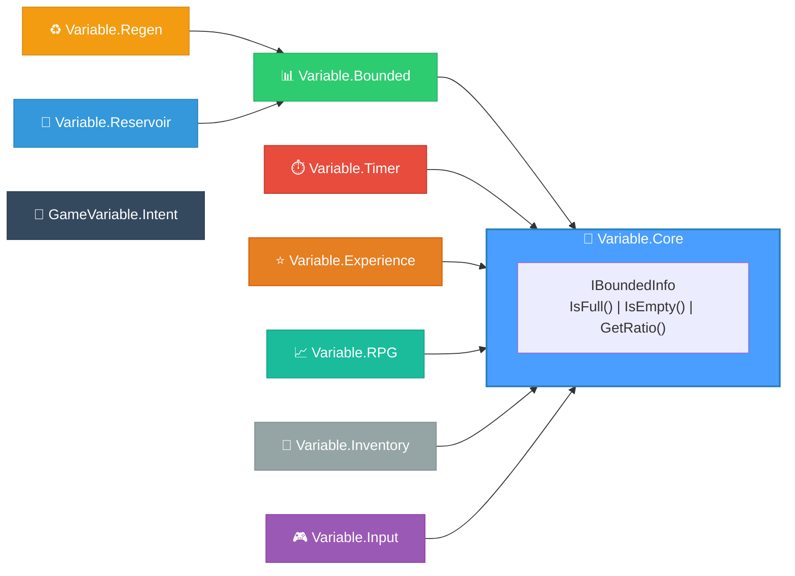

<div align="center">

# 🎮 GameVariable

### High-Performance Game State Management for C#

[](https://www.nuget.org/packages/Variable.Core)
[](LICENSE)
[](https://dotnet.microsoft.com/)
[](https://unity.com/)

**Zero-allocation structs for health bars, cooldowns, experience systems, and more.**

[Quick Start](#-quick-start) •
[Packages](#-packages) •
[Examples](#-examples) •
[API Reference](#-api-reference) •
[Contributing](#-contributing)

</div>

---

## ✨ Why GameVariable?

Building game systems means managing **bounded values** everywhere—health that can't go negative, cooldowns that tick down, experience that overflows into levels. GameVariable provides battle-tested primitives that handle all the edge cases, so you can focus on gameplay.

<table>
<tr>
<td width="50%">

### ❌ Without GameVariable
```csharp
// Manual clamping everywhere
health -= damage;
if (health < 0) health = 0;
if (health > maxHealth) health = maxHealth;

// Manual timer logic
cooldown -= deltaTime;
if (cooldown < 0) cooldown = 0;
bool canUse = cooldown <= 0;

// Manual regen with edge cases
mana += regenRate * deltaTime;
if (mana > maxMana) mana = maxMana;
```

</td>
<td width="50%">

### ✅ With GameVariable
```csharp
// Auto-clamped, natural syntax
health -= damage;
if (health.IsEmpty()) Die();

// Built-in timer semantics
cooldown.Tick(deltaTime);
if (cooldown.IsFull()) UseAbility();

// One-liner regeneration
mana.Tick(deltaTime); // Automatic!
```

</td>
</tr>
</table>

### 🎯 Key Features

| Feature | Description |
|---------|-------------|
| **🚀 Zero Allocation** | Pure `struct` types—no heap, no GC pressure |
| **⚡ Burst Compatible** | Works with Unity's Burst compiler & DOTS/ECS |
| **🔧 Operator Overloads** | Natural syntax: `hp -= 10`, `timer++`, `ammo--` |
| **📊 Built-in Ratios** | `GetRatio()` for health bars, progress indicators |
| **🎨 Serializable** | `[Serializable]` for Unity Inspector & save systems |
| **🌐 Network Ready** | Blittable structs for easy network serialization |

---

## 🚀 Quick Start

### Installation

```bash
# Install all packages
dotnet add package Variable.Core
dotnet add package Variable.Bounded
dotnet add package Variable.Timer
dotnet add package Variable.Regen
dotnet add package Variable.Experience
dotnet add package Variable.RPG
dotnet add package Variable.Reservoir
dotnet add package Variable.Input
dotnet add package Variable.Inventory
dotnet add package GameVariable.Intent

# Or install just what you need
dotnet add package Variable.Bounded
```

### Basic Usage

```csharp
using Variable.Bounded;
using Variable.Timer;
using Variable.Regen;

// Health: auto-clamped between 0 and 100
var health = new BoundedFloat(100f);
health -= 25f;                    // Take damage
Console.WriteLine(health);        // "75/100"
Console.WriteLine(health.GetRatio()); // 0.75

// Cooldown: 3 second ability
var fireball = new Cooldown(3f);
fireball.Tick(deltaTime);         // Count down
if (fireball.IsFull()) {          // Ready when 0
    CastFireball();
    fireball.Reset();             // Start cooldown
}

// Mana: regenerates 10/sec
var mana = new RegenFloat(100f, 50f, 10f);
mana.Tick(deltaTime);             // Auto-regenerate
```

---

## 📦 Packages



| Package | Types | Use Cases |
|---------|-------|-----------|
| [**Variable.Core**](./Variable.Core) | `IBoundedInfo` | Base interface for all bounded types |
| [**Variable.Bounded**](./Variable.Bounded) | `BoundedFloat`, `BoundedInt`, `BoundedShort`, `BoundedByte` | Health, mana, stamina, armor, shields |
| [**Variable.Timer**](./Variable.Timer) | `Timer`, `Cooldown` | Ability cooldowns, buffs, casting times |
| [**Variable.Regen**](./Variable.Regen) | `RegenFloat`, `RegenLogic` | Auto-regenerating resources, decay |
| [**Variable.Reservoir**](./Variable.Reservoir) | `ReservoirFloat`, `ReservoirInt` | Ammo clips + reserves, batteries |
| [**Variable.Experience**](./Variable.Experience) | `ExperienceInt`, `ExperienceLong` | XP, leveling, skill progression |
| [**Variable.RPG**](./Variable.RPG) | `RpgStat`, `DamageLogic` | RPG stats with flat/% modifiers, damage pipelines |
| [**Variable.Inventory**](./Variable.Inventory) | `InventoryLogic` | Capacity management, transfers |
| [**Variable.Input**](./Variable.Input) | `ComboGraph`, `InputRingBuffer` | Deterministic combo systems, input buffering |
| [**GameVariable.Intent**](./GameVariable.Intent) | `IntentState`, `IIntent` | Hierarchical State Machines (HSM), AI logic |

---

## 💡 Examples

### 🏥 Health System

```csharp
public struct Player
{
    public BoundedFloat Health;
    public BoundedFloat Shield;
    
    public void TakeDamage(float damage)
    {
        // Damage shields first
        if (Shield > 0)
        {
            float absorbed = Math.Min(Shield, damage);
            Shield -= absorbed;
            damage -= absorbed;
        }
        
        // Remaining damage hits health
        Health -= damage;
        
        if (Health.IsEmpty())
            Die();
    }
}

// Usage
var player = new Player
{
    Health = new BoundedFloat(100f),
    Shield = new BoundedFloat(50f)
};

player.TakeDamage(75f);  // Shield: 0, Health: 75
```

### ⚔️ Ability Cooldown

```csharp
public struct Ability
{
    public Cooldown Cooldown;
    public float ManaCost;
    
    public bool TryUse(ref BoundedFloat mana)
    {
        if (!Cooldown.IsFull()) return false;  // On cooldown
        if (mana < ManaCost) return false;     // Not enough mana
        
        mana -= ManaCost;
        Cooldown.Reset();  // Start cooldown
        return true;
    }
    
    public void Update(float deltaTime)
    {
        Cooldown.Tick(deltaTime);
    }
}

// Usage
var fireball = new Ability
{
    Cooldown = new Cooldown(3f),  // 3 second cooldown
    ManaCost = 25f
};

var mana = new BoundedFloat(100f, 80f);

if (fireball.TryUse(ref mana))
    SpawnFireball();
```

### 🔫 Ammo & Reloading

```csharp
public struct Weapon
{
    public ReservoirInt Ammo;
    
    public bool TryFire()
    {
        if (Ammo.Volume.IsEmpty()) return false;
        Ammo.Volume--;
        return true;
    }
    
    public void Reload()
    {
        Ammo.Refill();  // Transfer from reserve to magazine
    }
}

// Usage
var pistol = new Weapon
{
    Ammo = new ReservoirInt(12, 12, 36)  // 12/12 mag, 36 reserve
};

pistol.TryFire();  // 11/12, 36 reserve
pistol.Reload();   // 12/12, 35 reserve
```

### ⭐ Experience & Leveling

```csharp
public struct Character
{
    public ExperienceInt Experience;
    
    public void GainXP(int amount)
    {
        Experience = Experience + amount;
        
        while (Experience.IsFull())
        {
            LevelUp();
        }
    }
    
    private void LevelUp()
    {
        int overflow = Experience.Current - Experience.Max;
        int newLevel = Experience.Level + 1;
        int newMax = newLevel * 1000;  // Linear scaling
        
        Experience = new ExperienceInt(newMax, overflow, newLevel);
        
        Console.WriteLine($"Level Up! Now level {newLevel}");
    }
}

// Usage
var hero = new Character
{
    Experience = new ExperienceInt(1000, 0, 1)  // Level 1, 0/1000 XP
};

hero.GainXP(1500);  // Level 2! (500/2000 XP)
```

### 🌡️ Temperature with Negative Range

```csharp
// Temperature system: -50°C to 50°C
var temperature = new RangeFloat(-50f, 50f, 20f);  // Starting at 20°C

temperature -= 30f;  // Now -10°C (cold!)
temperature += 100f; // Clamped to 50°C (max)

float freezeProgress = temperature.GetRatio();  // 0.0 = -50°C, 1.0 = 50°C

if (temperature.Current < 0)
    ApplyFrostbite();
```

### 🛡️ RPG Stats with Modifiers

```csharp
// Base stat with modifiers
float baseStrength = 10f;
float flatBonus = 5f;        // +5 from equipment
float percentBonus = 0.2f;   // +20% from buff
float percentMult = 1.1f;    // x1.1 from passive

float finalStrength = StatLogic.Calculate(
    baseStrength, 
    flatBonus, 
    percentBonus, 
    percentMult
);
// Result: (10 + 5) * (1 + 0.2) * 1.1 = 19.8
```

---

## 🔧 API Reference

### BoundedFloat / BoundedInt

```csharp
// Construction
var hp = new BoundedFloat(100f);           // Max=100, Min=0, Current=100
var hp = new BoundedFloat(100f, 50f);      // Max=100, Min=0, Current=50  
var hp = new BoundedFloat(100f, -50f, 0f); // Max=100, Min=-50, Current=0

// Properties
hp.Current   // The current value
hp.Min       // The minimum bound
hp.Max       // The maximum bound

// Methods
hp.IsFull()    // Current == Max
hp.IsEmpty()   // Current == Min
hp.GetRatio()  // (Current - Min) / (Max - Min)
hp.Normalize() // Re-clamp after direct modification

// Operators
hp += 10f;  hp -= 10f;  hp++;  hp--;

// Implicit conversion
float current = hp;  // Returns Current
```

### Timer / Cooldown

```csharp
// Timer: counts UP from 0 to Duration
var timer = new Timer(5f);      // 5 second timer
timer.Tick(deltaTime);          // Add time
timer.IsFull();                 // true when >= Duration
timer.Reset();                  // Set to 0
timer.Finish();                 // Set to Duration

// Cooldown: counts DOWN from Duration to 0  
var cd = new Cooldown(3f);      // 3 second cooldown
cd.Tick(deltaTime);             // Subtract time
cd.IsFull();                    // true when <= 0 (ready!)
cd.Reset();                     // Set to Duration (start cooldown)
cd.Finish();                    // Set to 0 (skip cooldown)
```

### RegenFloat

```csharp
// Auto-regenerating value
var mana = new RegenFloat(100f, 50f, 10f);  // Max, Current, Rate
mana.Tick(deltaTime);  // Regenerates 10/sec

// Decay (negative rate)
var poison = new RegenFloat(100f, 100f, -5f);  // Decays 5/sec
```

---

## 🏗️ Architecture

### Design Philosophy

| Principle | Implementation |
|-----------|----------------|
| **Pure Data** | All types are `struct` with only data fields |
| **Logic Separation** | Static `*Logic` classes contain algorithms |
| **Zero Allocation** | No `new` on heap, no closures, no boxing |
| **Burst Compatible** | `[MethodImpl(AggressiveInlining)]` everywhere |
| **Fail Safe** | Values auto-clamp, no invalid states possible |

### Memory Layout

```csharp
// All structs are sequential and blittable
[StructLayout(LayoutKind.Sequential)]
public struct BoundedFloat  // 12 bytes
{
    public float Current;   // 4 bytes
    public float Min;       // 4 bytes
    public float Max;       // 4 bytes
}

// Perfect for Unity ECS components
public struct HealthComponent : IComponentData
{
    public BoundedFloat Value;
}
```

---

## 🎮 Unity Integration

### ECS/DOTS Example

```csharp
using Unity.Entities;
using Unity.Burst;
using Variable.Bounded;
using Variable.Regen;

public struct Health : IComponentData
{
    public BoundedFloat Value;
}

public struct Mana : IComponentData
{
    public RegenFloat Value;
}

[BurstCompile]
public partial struct RegenerationSystem : ISystem
{
    [BurstCompile]
    public void OnUpdate(ref SystemState state)
    {
        float dt = SystemAPI.Time.DeltaTime;
        
        foreach (var mana in SystemAPI.Query<RefRW<Mana>>())
        {
            mana.ValueRW.Value.Tick(dt);
        }
    }
}
```

### MonoBehaviour Example

```csharp
using UnityEngine;
using Variable.Bounded;
using Variable.Timer;

public class PlayerController : MonoBehaviour
{
    [SerializeField] private float maxHealth = 100f;
    [SerializeField] private float dashCooldown = 2f;
    
    private BoundedFloat _health;
    private Cooldown _dashCd;
    
    void Start()
    {
        _health = new BoundedFloat(maxHealth);
        _dashCd = new Cooldown(dashCooldown);
    }
    
    void Update()
    {
        _dashCd.Tick(Time.deltaTime);
        
        if (Input.GetKeyDown(KeyCode.Space) && _dashCd.IsFull())
        {
            Dash();
            _dashCd.Reset();
        }
    }
    
    public void TakeDamage(float amount)
    {
        _health -= amount;
        
        if (_health.IsEmpty())
            Die();
    }
}
```

---

## 📝 Contributing

Contributions are welcome! Please read our [Contributing Guidelines](CONTRIBUTING.md) before submitting PRs.

### Development Setup

```bash
git clone https://github.com/iafahim/GameVariable.git
cd GameVariable
dotnet restore
dotnet build
dotnet test
```

### Code Standards

- All public types must have XML documentation
- All structs must be `[Serializable]` and `[StructLayout(Sequential)]`
- All methods should use `[MethodImpl(AggressiveInlining)]`
- Tests required for all new functionality

---

## 📄 License

MIT License - see [LICENSE](LICENSE) for details.

---

<div align="center">

**Made with ❤️ for game developers**

**Author:** Md Ishtiaq Ahamed Fahim  
**GitHub:** [iafahim/GameVariable](https://github.com/iafahim/GameVariable)  
**Email:** iafahim.dev@gmail.com

</div>
