<div align="center">

# 🎮 GameVariable

### High-Performance Game State Management for C#

[](https://www.nuget.org/packages/Variable.Core)
[](LICENSE)
[](https://dotnet.microsoft.com/)
[](https://unity.com/)

**The "Standard Library" for Game Mechanics.** 🛠️
Stop writing `if (health < 0) health = 0;` for the 1,000th time.

[Quick Start](#-quick-start) •
[Packages](#-packages) •
[Guide](#-which-package-do-i-need) •
[Examples](#-examples) •
[Contributing](#-contributing)

</div>

---

## ✨ Why GameVariable?

Every game needs Health, Mana, Cooldowns, and XP.
Most developers write ad-hoc, buggy classes for each one.
**GameVariable** gives you **battle-tested, zero-allocation primitives** that handle the math for you.

<table>
<tr>
<td width="50%">

### ❌ The Old Way
```csharp
// Manual clamping... everywhere
health -= damage;
if (health < 0) health = 0;
if (health > maxHealth) health = maxHealth;

// Manual timer spaghetti
cooldown -= deltaTime;
if (cooldown < 0) cooldown = 0;
bool canUse = cooldown <= 0;

// Forgot to handle overflow?
xp += 5000; // Now level 1 has 5000/100 XP 😱
```

</td>
<td width="50%">

### ✅ The GameVariable Way
```csharp
// Auto-clamped. Always safe.
health -= damage;
if (health.IsEmpty()) Die();

// Built-in timer semantics
cooldown.Tick(deltaTime);
if (cooldown.IsFull()) UseAbility();

// Handles massive level-ups automatically
experience.Add(5000);
// Result: Level 50! 🚀
```

</td>
</tr>
</table>

---

## 📦 Packages

**Choose your weapon!** ⚔️

```mermaid
graph LR
    subgraph Core["🔷 Variable.Core"]
        IBoundedInfo["IBoundedInfo"]
    end
    
    Bounded["📊 Variable.Bounded"] --> Core
    Timer["⏱️ Variable.Timer"] --> Core
    Regen["♻️ Variable.Regen"] --> Bounded
    Reservoir["🔋 Variable.Reservoir"] --> Bounded
    Experience["⭐ Variable.Experience"] --> Core
    RPG["📈 Variable.RPG"] --> Core
    Inventory["🎒 Variable.Inventory"] --> Core
    Input["🎮 Variable.Input"] --> Core
    Curve["🎢 Variable.Curve"] --> Core
    Intent["🧠 GameVariable.Intent"]
    
    style Core fill:#4a9eff,stroke:#2980b9,stroke-width:2px,color:#fff
    style Bounded fill:#2ecc71,stroke:#27ae60,color:#fff
    style Timer fill:#e74c3c,stroke:#c0392b,color:#fff
    style Regen fill:#f39c12,stroke:#d68910,color:#fff
    style Reservoir fill:#3498db,stroke:#2980b9,color:#fff
    style Experience fill:#e67e22,stroke:#d35400,color:#fff
    style RPG fill:#1abc9c,stroke:#16a085,color:#fff
    style Inventory fill:#95a5a6,stroke:#7f8c8d,color:#fff
    style Input fill:#9b59b6,stroke:#8e44ad,color:#fff
    style Curve fill:#e84393,stroke:#d63031,color:#fff
    style Intent fill:#34495e,stroke:#2c3e50,color:#fff
```



### 🧐 Which package do I need?

| If you need to build... | Use this package |
|-------------------------|------------------|
| **Health, Mana, Stamina** | [**Variable.Bounded**](./Variable.Bounded) |
| **Cooldowns, Casting Bars** | [**Variable.Timer**](./Variable.Timer) |
| **Regenerating Shields** | [**Variable.Regen**](./Variable.Regen) |
| **Ammo, Batteries, Fuel** | [**Variable.Reservoir**](./Variable.Reservoir) |
| **Leveling, Skills, XP** | [**Variable.Experience**](./Variable.Experience) |
| **Combos, Input Buffers** | [**Variable.Input**](./Variable.Input) |
| **Complex Stats (Armor/Resist)** | [**Variable.RPG**](./Variable.RPG) |
| **Inventory Limits** | [**Variable.Inventory**](./Variable.Inventory) |
| **Animations, Tweens** | [**Variable.Curve**](./Variable.Curve) |
| **AI State Machines** | [**GameVariable.Intent**](./GameVariable.Intent) |

---

## 🚀 Quick Start

### Installation

```bash
# Install the basics
dotnet add package Variable.Bounded
dotnet add package Variable.Timer
```

### 1. The "Ultimate Character" Example

Let's build a character using multiple packages!

```csharp
using Variable.Bounded;
using Variable.Timer;
using Variable.Regen;
using Variable.Experience;

public struct Hero
{
    // 1. Health (0-100)
    public BoundedFloat Health;
    
    // 2. Mana that regens (+5/sec)
    public RegenFloat Mana;

    // 3. Ability Cooldown (3 sec)
    public Cooldown FireballCd;
    
    // 4. Leveling System
    public ExperienceInt XP;

    public Hero(float maxHp)
    {
        Health = new BoundedFloat(maxHp);
        Mana = new RegenFloat(100f, 100f, 5f); // Starts full
        FireballCd = new Cooldown(3f);         // Starts ready
        XP = new ExperienceInt(1000);          // Need 1000 for lvl 2
    }

    public void Update(float dt)
    {
        // Auto-regen mana
        Mana.Tick(dt);
        
        // Tick cooldown
        FireballCd.Tick(dt);
    }
    
    public void CastFireball()
    {
        if (FireballCd.IsReady() && Mana.Value >= 20f)
        {
            Mana.Value -= 20f;
            FireballCd.Reset();
            Console.WriteLine("KA-BOOM! 🔥");
        }
    }
}
```

---

## 💡 Cool Tricks

### Temperature System (Negative Ranges) ❄️🔥
`BoundedFloat` isn't just for 0-100. It handles negative ranges perfectly.

```csharp
// Range: -50°C to +50°C. Starts at 20°C.
var temp = new BoundedFloat(50f, -50f, 20f);

temp -= 100f; // Clamped to -50f (Absolute Zero-ish)

if (temp.IsEmpty()) ApplyFrostbite();
```

### Progress Bars in UI 📊
All bounded types implement `IBoundedInfo`. You can write **one** UI script for everything!

```csharp
public void UpdateBar(IBoundedInfo info)
{
    // Works for Health, Mana, Timer, XP... anything!
    barImage.fillAmount = (float)info.GetRatio();
}
```

---

## 🏗️ Architecture & Philosophy

1.  **Zero Allocation:** Everything is a `struct`. No `new` keywords in your update loop. No Garbage Collection spikes.
2.  **Burst Compatible:** Optimized for Unity's DOTS/ECS and Burst Compiler.
3.  **Fail-Safe:** Math is clamped. State is consistent. No `NaN` or `Infinity` surprises.

---

## 🤝 Contributing

We love PRs! Please read [CONTRIBUTING.md](CONTRIBUTING.md) first.

*   **Found a bug?** Open an issue.
*   **Have an idea?** Start a discussion.

---

<div align="center">

**Made with ❤️ for game developers**

**Author:** Md Ishtiaq Ahamed Fahim  
**GitHub:** [iafahim/GameVariable](https://github.com/iafahim/GameVariable)  
**Email:** iafahim.dev@gmail.com

</div>
