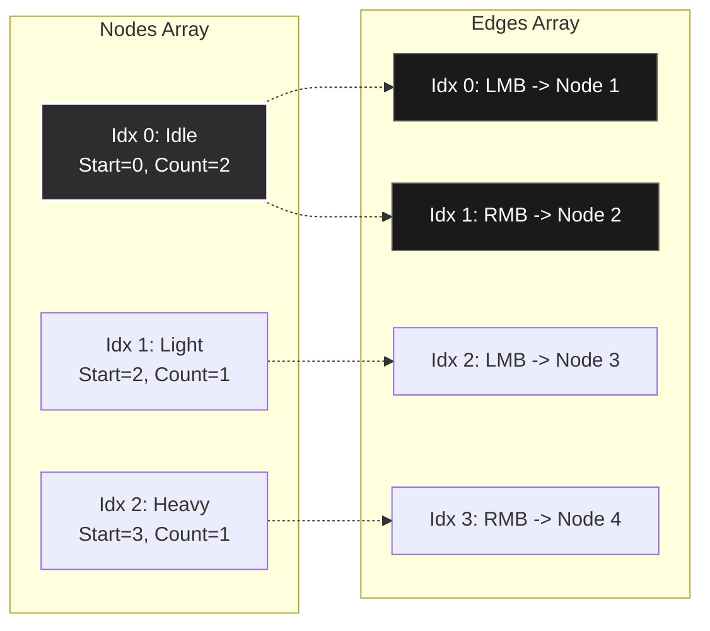

# Variable.Input - Combo System

**A zero-allocation, Burst-compatible combo/skill system for Unity.**

---

## 🧠 The Mental Model: It's Just a Tree of Moves!

Forget the technical terms. Think of your combo system as a **tree of moves**:

```
         [Idle]
        /      \
    LMB/        \RMB
      /          \
 [Light]       [Heavy]
    |             |
   LMB           RMB
    |             |
[Light-Light] [Heavy-Heavy]
```

**That's it!** Each box is a "node" (a move), and each arrow is an "edge" (a button press that connects moves).

---

## 📖 Plain English Glossary

| Term                | What It Actually Means                                                  |
|---------------------|-------------------------------------------------------------------------|
| **Node**            | A single move/attack/ability (like "Light Punch" or "Heavy Kick")       |
| **Edge**            | "If I press THIS button, go to THAT move"                               |
| **ActionID**        | A number you assign to identify the move (e.g., `100` = "Light Attack") |
| **InputTrigger**    | Which button activates this transition (e.g., `LMB = 1`)                |
| **TargetNodeIndex** | Which move to go to next (index in your nodes array)                    |
| **EdgeStartIndex**  | Where this node's edges begin in the edges array                        |
| **EdgeCount**       | How many edges (button options) this node has                           |

---

## 🎮 Example 1: Visual GameObject Tree (Beginner-Friendly)

**The easiest way to understand combos: Make each move a GameObject!**

### Setup in Hierarchy

```
Player
└── ComboTree
    ├── Node_Idle          (Index 0)
    ├── Node_LightAttack   (Index 1)
    ├── Node_HeavyAttack   (Index 2)
    ├── Node_LightLight    (Index 3)
    └── Node_HeavyHeavy    (Index 4)
```

### Step 1: Define Your Button IDs

```csharp
// Inputs.cs - Give each button a unique number
public static class Inputs
{
    public const int None = 0;
    public const int LMB = 1;   // Left Mouse Button
    public const int RMB = 2;   // Right Mouse Button
    public const int Space = 3;
}
```

### Step 2: Create a Simple Transition Component

```csharp
// ComboTransition.cs - Attach to each "move" GameObject
using UnityEngine;
using Variable.Input;

/// <summary>
/// Defines what buttons can be pressed from this move, and where they lead.
/// </summary>
[System.Serializable]
public class Transition
{
    [Tooltip("Which button press triggers this transition?")]
    public int InputButton;
    
    [Tooltip("Which GameObject/Move do we go to?")]
    public GameObject TargetNode;
}

public class ComboTransition : MonoBehaviour
{
    [Tooltip("Unique ID for this move (used by animation system)")]
    public int ActionID;
    
    [Tooltip("All possible moves you can chain into from here")]
    public Transition[] NextMoves;
}
```

### Step 3: The Visual Controller

```csharp
// VisualComboController.cs - Reads your GameObject tree and builds the graph
using UnityEngine;
using System.Collections.Generic;
using Variable.Input;

public class VisualComboController : MonoBehaviour
{
    [Header("=== SETUP ===")]
    [Tooltip("Drag all your move GameObjects here (in order!)")]
    public ComboTransition[] AllMoves;
    
    [Header("=== DEBUG (Read-Only) ===")]
    public int CurrentMoveIndex;
    public bool IsAttacking;
    public int BufferedInputs;
    
    // Internal
    private ComboNode[] _nodes;
    private ComboEdge[] _edges;
    private ComboState _state;
    private InputRingBuffer _buffer;
    private Dictionary<GameObject, int> _nodeToIndex;
    
    void Awake()
    {
        BuildGraphFromGameObjects();
    }

    // No OnDestroy needed for managed arrays!
    
    void Update()
    {
        // 1. Capture button presses
        if (Input.GetMouseButtonDown(0)) _buffer.RegisterInput(Inputs.LMB);
        if (Input.GetMouseButtonDown(1)) _buffer.RegisterInput(Inputs.RMB);
        if (Input.GetKeyDown(KeyCode.Space)) _buffer.RegisterInput(Inputs.Space);
        
        // 2. Try to advance combo
        // Create a graph view from our arrays
        var graph = new ComboGraph(_nodes, _edges);
        
        if (_state.TryUpdate(ref _buffer, graph, out int actionID))
        {
            ExecuteMove(actionID);
        }
        
        // ... rest of update
    }
    
    void BuildGraphFromGameObjects()
    {
        // ... (same mapping logic) ...
        
        // Build arrays
        _nodes = new ComboNode[AllMoves.Length];
        _edges = new ComboEdge[totalEdges];
        
        // ... (same population logic) ...
        
        // No unsafe memory allocation needed!
        // The arrays are ready to use.
    }
    
    void ExecuteMove(int actionID)
    {
        Debug.Log($"<color=cyan>Executing Move: {actionID}</color>");
        
        // TODO: Play animation, spawn VFX, deal damage, etc.
        // For demo, just wait a bit
        Invoke(nameof(OnMoveComplete), 0.5f);
    }
    
    void OnMoveComplete()
    {
        _state.SignalActionFinished();
        
        // Check if there's a buffered input waiting
        if (_state.TryUpdate(ref _buffer, _graph, out int nextAction))
        {
            ExecuteMove(nextAction);
        }
    }
    
    void UpdateVisuals()
    {
        // Enable only the active move's GameObject
        for (int i = 0; i < AllMoves.Length; i++)
        {
            AllMoves[i].gameObject.SetActive(i == _state.CurrentNodeIndex);
        }
    }
    
    /// <summary>
    /// Call this from Animation Events when your attack animation ends.
    /// </summary>
    public void OnAnimationEnd()
    {
        OnMoveComplete();
    }
}
```

### Step 4: Set Up in Unity Inspector

1. Create empty GameObjects for each move under `ComboTree`
2. Add `ComboTransition` to each
3. Set `ActionID` (e.g., Idle=0, Light=100, Heavy=200)
4. Drag target GameObjects into `NextMoves`
5. Add `VisualComboController` to Player
6. Drag all moves into `AllMoves` array **in order**

**Result:** You can now design combos by just dragging GameObjects in the Inspector!

---

## 🎮 Example 2: ScriptableObject Designer Tool

**For designers who want to create combo assets without code.**

### The Combo Asset

```csharp
// ComboAsset.cs - Create via Assets > Create > Game > Combo
using UnityEngine;
using System.Collections.Generic;
using Variable.Input;

[CreateAssetMenu(menuName = "Game/Combo", fileName = "NewCombo")]
public class ComboAsset : ScriptableObject
{
    [System.Serializable]
    public class Move
    {
        [Tooltip("Name for readability (not used in code)")]
        public string Name;
        
        [Tooltip("Unique ID for this move")]
        public int ActionID;
        
        [Tooltip("Transitions to other moves")]
        public List<MoveTransition> Transitions = new();
    }
    
    [System.Serializable]
    public class MoveTransition
    {
        [Tooltip("Button that triggers this (use your Inputs constants)")]
        public int Button;
        
        [Tooltip("Index of the target move in the Moves array")]
        public int GoToMoveIndex;
    }
    
    [Header("All Moves (Index 0 is always the starting point)")]
    public List<Move> Moves = new();
    
    /// <summary>
    /// Converts this designer-friendly format to the optimized runtime format.
    /// Note: Caller is responsible for freeing the returned pointers!
    /// </summary>
    public (ComboNode[] nodes, ComboEdge[] edges) BuildArrays()
    {
        // Count edges
        int totalEdges = 0;
        foreach (var move in Moves)
            totalEdges += move.Transitions.Count;
        
        var nodes = new ComboNode[Moves.Count];
        var edges = new ComboEdge[totalEdges];
        int edgeIdx = 0;
        
        for (int i = 0; i < Moves.Count; i++)
        {
            var move = Moves[i];
            
            nodes[i] = new ComboNode
            {
                ActionID = move.ActionID,
                EdgeStartIndex = edgeIdx,
                EdgeCount = move.Transitions.Count
            };
            
            foreach (var t in move.Transitions)
            {
                edges[edgeIdx++] = new ComboEdge
                {
                    InputTrigger = t.Button,
                    TargetNodeIndex = t.GoToMoveIndex
                };
            }
        }
        
        return (nodes, edges);
    }
    
    #if UNITY_EDITOR
    [ContextMenu("Validate")]
    void Validate()
    {
        for (int i = 0; i < Moves.Count; i++)
        {
            foreach (var t in Moves[i].Transitions)
            {
                if (t.GoToMoveIndex < 0 || t.GoToMoveIndex >= Moves.Count)
                {
                    Debug.LogError($"Move '{Moves[i].Name}' has invalid target index: {t.GoToMoveIndex}");
                }
            }
        }
        Debug.Log("<color=green>Validation passed!</color>");
    }
    #endif
}
```

### Using the Asset

```csharp
// ComboPlayer.cs
using UnityEngine;
using Variable.Input;

public class ComboPlayer : MonoBehaviour
{
    [SerializeField] ComboAsset comboAsset;
    [SerializeField] Animator animator;
    
    ComboNode[] _nodes;
    ComboEdge[] _edges;
    ComboState _state;
    InputRingBuffer _buffer;
    
    void Awake()
    {
        // Build managed arrays from the asset
        (_nodes, _edges) = comboAsset.BuildArrays();
    }
    
    void Update()
    {
        // Capture inputs
        if (Input.GetMouseButtonDown(0)) _buffer.RegisterInput(Inputs.LMB);
        if (Input.GetMouseButtonDown(1)) _buffer.RegisterInput(Inputs.RMB);
        
        // Process
        // Create a graph view on the fly (zero allocation struct)
        var graph = new ComboGraph(_nodes, _edges);
        
        if (_state.TryUpdate(ref _buffer, graph, out int actionID))
        {
            animator.SetTrigger($"Action_{actionID}");
        }
    }
    
    // Call from Animation Event at end of attack animation
    public void OnAttackEnd() => _state.SignalActionFinished();
}
```

### Sample Asset Configuration

```
Moves:
  [0] Name: "Idle"       ActionID: 0
      Transitions:
        - Button: 1 (LMB)  GoToMoveIndex: 1
        - Button: 2 (RMB)  GoToMoveIndex: 2
        
  [1] Name: "Light"      ActionID: 100
      Transitions:
        - Button: 1 (LMB)  GoToMoveIndex: 3
        
  [2] Name: "Heavy"      ActionID: 200
      Transitions:
        - Button: 2 (RMB)  GoToMoveIndex: 4
        
  [3] Name: "LightLight" ActionID: 101
      Transitions: (empty - combo finisher)
      
  [4] Name: "HeavyHeavy" ActionID: 201
      Transitions: (empty - combo finisher)
```

---

## 🎮 Example 3: Pure Code (Advanced/ECS)

**For programmers who want maximum control and performance.**

### Using ComboGraphBuilder

The package includes a helper to build graphs without manual array indexing.

```csharp
// AdvancedComboBuilder.cs
using Variable.Input;

public class AdvancedComboBuilder
{
    public (ComboNode[] nodes, ComboEdge[] edges) Build()
    {
        var builder = new ComboGraphBuilder();

        // 1. Create Nodes (Returns their index)
        int idle = builder.AddNode(0);       // ID 0: Idle
        int light = builder.AddNode(100);    // ID 100: Light Attack
        int heavy = builder.AddNode(200);    // ID 200: Heavy Attack
        int lightEnd = builder.AddNode(101); // ID 101: Light-Light
        int heavyEnd = builder.AddNode(201); // ID 201: Heavy-Heavy

        // 2. Define Transitions (Edges)
        // From Idle
        builder.AddEdge(idle, light, Inputs.LMB);
        builder.AddEdge(idle, heavy, Inputs.RMB);

        // From Light
        builder.AddEdge(light, lightEnd, Inputs.LMB);

        // From Heavy
        builder.AddEdge(heavy, heavyEnd, Inputs.RMB);

        // 3. Bake to Arrays
        return builder.Build();
    }
}
```

### Understanding the Generated Data (CSR Format)

```
VISUAL REPRESENTATION:

Nodes Array:
┌─────┬─────────┬────────────────┬───────────┐
│ Idx │ ActionID│ EdgeStartIndex │ EdgeCount │
├─────┼─────────┼────────────────┼───────────┤
│  0  │    0    │       0        │     2     │ ← Idle: edges at [0,1]
│  1  │   100   │       2        │     1     │ ← Light: edge at [2]
│  2  │   200   │       3        │     1     │ ← Heavy: edge at [3]
│  3  │   101   │       4        │     0     │ ← LL: no edges
│  4  │   201   │       4        │     0     │ ← HH: no edges
└─────┴─────────┴────────────────┴───────────┘

Edges Array:
┌─────┬──────────────┬─────────────────┐
│ Idx │ InputTrigger │ TargetNodeIndex │
├─────┼──────────────┼─────────────────┤
│  0  │     LMB      │        1        │ ← Idle's 1st edge
│  1  │     RMB      │        2        │ ← Idle's 2nd edge
│  2  │     LMB      │        3        │ ← Light's edge
│  3  │     RMB      │        4        │ ← Heavy's edge
└─────┴──────────────┴─────────────────┘

When at Node 0 (Idle):
  - EdgeStartIndex = 0, EdgeCount = 2
  - Check edges[0] and edges[1] for matching input
  - If LMB pressed: edges[0] matches → go to node 1
  - If RMB pressed: edges[1] matches → go to node 2
```

### Mermaid Diagram: CSR Structure



### ECS/Jobs Usage

```csharp
// For Unity DOTS - works with NativeArray and BlobAssets
using Unity.Collections;
using Unity.Jobs;
using Variable.Input;

public struct ProcessComboJob : IJobParallelFor
{
    [ReadOnly] public NativeArray<ComboNode> Nodes;
    [ReadOnly] public NativeArray<ComboEdge> Edges;
    public NativeArray<ComboState> States;
    public NativeArray<InputRingBuffer> Buffers;
    public NativeArray<int> ResultActions;
    
    public void Execute(int index)
    {
        var state = States[index];
        var buffer = Buffers[index];
        
        // Create span for inputs
        var inputs = MemoryMarshal.CreateSpan(ref buffer.Input0, 8);
        
        if (ComboLogic.TryAdvanceState(
            ref state.CurrentNodeIndex,
            ref state.IsActionBusy,
            ref buffer.Head,
            ref buffer.Count,
            inputs,
            Nodes,
            Edges,
            out int action))
        {
            ResultActions[index] = action;
        }
        else
        {
            ResultActions[index] = -1;
        }
        
        States[index] = state;
        Buffers[index] = buffer;
    }
}
```

---

## 🔧 API Quick Reference

```csharp
// Register a button press
buffer.RegisterInput(Inputs.LMB);

// Try to advance combo (returns true if a new action triggered)
if (state.TryUpdate(ref buffer, graph, out int actionID))
{
    // actionID is the ActionID of the new current node
    PlayAnimation(actionID);
}

// Signal that current action/animation finished
state.SignalActionFinished();

// Reset to idle
state.Reset();

// Clear buffered inputs
buffer.Clear();
```

---

## ✨ Features

| Feature                | Description                                         |
|------------------------|-----------------------------------------------------|
| **Zero GC**            | No allocations during gameplay                      |
| **Burst-Compatible**   | Works with Unity Jobs and Burst compiler            |
| **Input Buffering**    | Stores up to 8 inputs for responsive combos         |
| **Crash-Proof**        | Validates all indices, auto-recovers from bad state |
| **Framework-Agnostic** | Core logic is pure C#, no Unity dependency          |

---

## 📁 Files Overview

| File                 | Purpose                                  |
|----------------------|------------------------------------------|
| `ComboGraph.cs`      | Ref struct wrapper for Spans (View)      |
| `ComboNode.cs`       | A single move (ActionID + edge pointers) |
| `ComboEdge.cs`       | A transition (button → target node)      |
| `ComboState.cs`      | Runtime state (current node + busy flag) |
| `InputRingBuffer*.cs` | `InputRingBuffer` (8 inputs) and `InputRingBuffer16` (16 inputs) |
| `ComboLogic.*.cs`    | Core traversal logic (stateless)         |
| `*Extensions.cs`     | Convenience methods                      |

---

## 🎯 Best Practices

1. **Index 0 is always "Idle"** - The starting/reset point
2. **Use meaningful ActionIDs** - e.g., `100-199` for light attacks, `200-299` for heavy
3. **Call `SignalActionFinished()`** from Animation Events for precise timing
4. **Buffer inputs generously** - Players appreciate responsive input
5. **Validate graphs in Editor** - Check for invalid indices before shipping

---

**See [UNITY_GUIDE.md](UNITY_GUIDE.md) for ECS, Jobs, and advanced patterns.** 🎮
