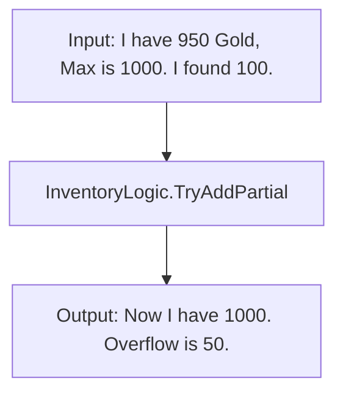

# 🎒 Variable.Inventory

**The Math of Stuff.** 🍎

**Variable.Inventory** is a pure logic library for handling inventory mathematics. It doesn't tell you *how* to store your items (List, Array, Dictionary) — it just handles the "Can I fit this?" and "Move this there" logic.

It is **stateless**, **zero-allocation**, and **Burst-compatible**.

---

## 📦 Installation

```bash
dotnet add package Variable.Inventory
```

---

## 🧠 Mental Model

Think of this package as a **Calculator for Stuff**.

It doesn't have a `class InventoryItem`. It just takes numbers (Current, Max, Amount) and gives you back numbers (New Current, Overflow).



---

## 🚀 Features

* **🧠 Pure Logic:** Static methods that work on `float`, `int`, `byte`.
* **⚖️ Weight Support:** Logic for transferring items with weight limits.
* **🌊 Partial vs Exact:** "Fill it as much as possible" vs "Only if it fits".
* **⚡ Burst Compatible:** All methods are `[AggressiveInlining]`.

---

## 🎮 Usage Guide

### 1. Looting (Partial Add)

You found 100 Gold, but can only carry 50 more.

```csharp
using Variable.Inventory;

float goldInBag = 950f;
float maxGold = 1000f;
float goldOnGround = 100f;

// "Try to add as much as possible!"
bool addedAny = InventoryLogic.TryAddPartial(
    ref goldInBag,
    goldOnGround,
    maxGold,
    out float addedAmount,
    out float overflow
);

// Result:
// goldInBag = 1000  (Full!)
// addedAmount = 50  (We took 50)
// overflow = 50     (50 remains on the ground)
```

### 2. Crafting (Exact Remove)

You need exactly 5 Wood to build a chair. You only have 3.

```csharp
float wood = 3f;
float cost = 5f;

// "Try to remove EXACTLY 5. If I don't have enough, do NOTHING."
// Returns false if you have less.
if (InventoryLogic.TryRemoveExact(ref wood, cost))
{
    BuildChair();
}
else
{
    Console.WriteLine("Not enough wood!"); // Prints this
}
```

### 3. Transferring Items (Chest to Player)

Move items from Container A to Container B.

```csharp
float chestCount = 100;
float bagCount = 10;
float bagMax = 50;

// "Move everything from Chest to Bag, but respect Bag's limit."
InventoryLogic.TryTransferPartial(
    ref chestCount,  // Source (decreases)
    ref bagCount,    // Destination (increases)
    bagMax,          // Dest Capacity
    1000,            // Try to move everything
    out float moved
);

// Result:
// chestCount = 60 (100 - 40)
// bagCount = 50 (Full)
// moved = 40
```

---

## 🔧 API Reference

### ➕ Add (Looting)
| Method | Behavior | Use Case |
|--------|----------|----------|
| `TryAddPartial` | Adds up to Max. Returns Overflow. | Looting gold/ammo. |
| `TryAddExact` | Adds **only** if it fits completely. | Quest rewards (Inventory full?). |

### ➖ Remove (Spending/Crafting)
| Method | Behavior | Use Case |
|--------|----------|----------|
| `TryRemovePartial` | Removes up to Amount. (Empties to 0). | Dropping items on death? |
| `TryRemoveExact` | Removes **only** if you have enough. | Crafting, buying items. |

### ↔️ Transfer
| Method | Behavior | Use Case |
|--------|----------|----------|
| `TryTransferPartial` | Moves items between variables. | Chest ➡️ Player |
| `TryTransferExact` | Moves only if full amount fits. | Trade windows? |

---

<div align="center">

**Part of the [GameVariable](https://github.com/iafahim/GameVariable) Ecosystem**
*Made with ❤️ for game developers*

</div>
