# 📈 Variable.RPG

**Complex Stats made Simple.** ⚔️

**Variable.RPG** is a high-performance system for handling RPG attributes (Strength, Agility) and complex damage calculations (Armor, Resistances, Elemental Damage).

It implements the **Diamond Architecture** pattern to ensure AAA-grade performance with zero garbage collection.

---

## 📦 Installation

```bash
dotnet add package Variable.RPG
```

---

## 👶 ELI5: How does it work?

Imagine you are building an RPG.

1.  **Attributes:** Your player has `Strength: 10`. You find a ring that gives `+5 Strength`. You cast a buff that gives `+20% Strength`.
    *   **Variable.RPG** calculates: `(10 + 5) * 1.20 = 18`. It handles all the math automatically.

2.  **Damage:** An enemy hits you with a **Fireball** (100 Fire Damage) and a **Physical Punch** (50 Damage) *at the same time*.
    *   You have **50% Fire Resistance**.
    *   You have **10 Armor**.
    *   **Variable.RPG** calculates:
        *   Fire: `100 * 0.5 = 50` damage.
        *   Physical: `50 - 10 = 40` damage.
        *   **Total:** `90` damage.

It does all this in **one fast step** without creating any temporary objects (garbage).

---

## 💎 The Diamond Architecture

Why "Diamond"? Because of how damage flows.

```mermaid
graph LR
    Source1[🔥 Fire Dmg] --> Aggregator
    Source2[🗡️ Phys Dmg] --> Aggregator
    Source3[⚡ Shock Dmg] --> Aggregator

    Aggregator[💎 The Funnel] --> Pipeline

    Pipeline[⚙️ Processing] --> Result

    Pipeline --> |Apply Armor| Mitigation1
    Pipeline --> |Apply Resist| Mitigation2

    Result[💥 Final Damage]
```



1.  **Multiple Sources:** A grenade explodes (Fire + Physical + Shock).
2.  **Aggregation:** All damage types are collected into a lightweight buffer.
3.  **Pipeline:** The system looks up your stats (Armor, Resist) for each type.
4.  **Single Result:** One final float value comes out.

---

## ⚡ Quick Start

```csharp
using Variable.RPG;

// 1. Define your Stat IDs (Integers)
public static class Stats {
    public const int Health = 0;
    public const int Armor = 1;
    public const int FireResist = 2;
}

// 2. Create your Character's Sheet
var sheet = new AttributeSheet(10); // Capacity for 10 different stats

// Set Base Values
sheet.SetBase(Stats.Health, 100f);
sheet.SetBase(Stats.Armor, 10f);       // Blocks 10 flat damage
sheet.SetBase(Stats.FireResist, 0.5f); // Blocks 50% fire damage

// 3. Add Modifiers (Buffs/Items)
// "Add 5 flat, and boost by 20%"
AttributeLogic.AddModifier(ref sheet.Attributes[Stats.Armor], 5f, 0.2f); 
// Armor is now: (10 + 5) * 1.2 = 18

// 4. Take Complex Damage
var incomingDamage = new[] {
    new DamagePacket { ElementId = DmgTypes.Physical, Amount = 50f }, // Punch
    new DamagePacket { ElementId = DmgTypes.Fire, Amount = 100f }     // Fireball
};

// 5. Calculate Final Damage
// You need a "Config" that tells the system which Stat reduces which Element
var finalDamage = DamageLogic.ResolveDamage(
    sheet.AsSpan(), 
    incomingDamage,
    new MyGameConfig());

// Result Calculation:
// Physical: 50 - 18 (Armor) = 32
// Fire: 100 * (1 - 0.5) = 50
// Total: 82 Damage
```

---

## 🏗️ Technical Details

### Data Layer (Structs)

```csharp
// 1. Attribute: A single stat with modifiers
public struct Attribute {
    public float Base;      // Base value (10 Strength)
    public float ModAdd;    // Flat bonuses (+5 from ring)
    public float ModMult;   // Multipliers (x1.2 from buff)
    public float Min, Max;  // Clamping bounds
    public float CachedValue; // The final calculated value
}

// 2. DamagePacket: A single instance of damage
public struct DamagePacket {
    public int ElementId;   // Fire, Physical, etc.
    public float Amount;    // 100.0
    public int Flags;       // Critical, Backstab, etc.
}
```

### Configuration (Your Rules)

You implement `IDamageConfig` to define the rules of your world.

```csharp
public struct MyGameConfig : IDamageConfig {
    public bool TryGetMitigationStat(int elementId, out int statId, out bool isFlat)
    {
        // "Physical damage is blocked by Armor (Flat)"
        if (elementId == DmgTypes.Physical) {
            statId = Stats.Armor;
            isFlat = true;
            return true;
        }

        // "Fire damage is resisted by FireResist (Percentage)"
        if (elementId == DmgTypes.Fire) {
            statId = Stats.FireResist;
            isFlat = false;
            return true;
        }

        return false; // No defense against this!
    }
}
```

---

## 🚀 Advanced Features

*   **Zero Allocation:** Designed for Unity's **Burst Compiler** and high-performance servers.
*   **Span-Based:** APIs use `Span<T>`, so they work with arrays, `List<T>`, `NativeArray<T>`, or `stackalloc`.
*   **Negative Resistance:** If resistance is negative (e.g. `-0.5`), damage is amplified (150% damage taken).
*   **Over-Armor:** If Armor is higher than damage, damage is clamped to 0 (no healing from attacks).

---

<div align="center">

**Part of the [GameVariable](https://github.com/iafahim/GameVariable) Ecosystem**
*Made with ❤️ for game developers*

</div>
